# 🏦 Loan Risk Prediction — End-to-End MLOps Pipeline

> M.Tech Assignment | Advanced MLOps and DevOps Engineering

## 📌 Overview

A production-grade MLOps pipeline for predicting loan risk built with industry-standard tools. Covers the full lifecycle: data versioning, experiment tracking, modular ML pipeline, REST API, Docker containerization, CI/CD automation, monitoring, drift detection, and DevSecOps.

**Model Performance:**
| Metric | Score |
|--------|-------|
| Accuracy | 79.67% |
| Precision | 84.09% |
| Recall | 87.06% |
| F1 Score | 85.55% |
| ROC-AUC | 80.25% |

---

## 🏗️ Architecture
Dataset (Kaggle)

│

▼

┌─────────────────┐

│  DVC Tracking   │  ← Raw data versioned with DVC + AWS S3

└────────┬────────┘

│

▼

┌─────────────────┐

│  Preprocessing  │  ← preprocess.py (imputation, encoding, scaling)

└────────┬────────┘

│

▼

┌─────────────────┐

│    Training     │  ← train.py (RandomForest + MLflow tracking)

└────────┬────────┘

│

▼

┌─────────────────┐

│   Evaluation    │  ← evaluate.py (metrics.json, confusion matrix)

└────────┬────────┘

│

▼

┌─────────────────┐

│  MLflow Server  │  ← Experiment tracking, parameter logging

└────────┬────────┘

│

▼

┌─────────────────┐

│ FastAPI + Docker│  ← REST API, containerized, Prometheus metrics

└────────┬────────┘

│

▼

┌─────────────────┐

│  CI/CD Pipeline │  ← GitHub Actions: lint→test→dvc→build→scan→push

└────────┬────────┘

│

▼

┌─────────────────┐

│   Monitoring    │  ← Prometheus + Grafana + Evidently AI drift

└────────┬────────┘

│

▼

┌─────────────────┐

│ Security (Trivy)│  ← Docker image scanning, secrets management

└─────────────────┘

---

## 🗂️ Project Structure
loan-risk-mlops/

├── data/

│   ├── raw/                    # Raw dataset (DVC tracked → S3)

│   └── processed/              # Preprocessed data (DVC tracked)

├── models/                     # Trained model (DVC tracked)

├── notebooks/01_EDA.ipynb      # Exploratory Data Analysis

├── src/

│   ├── preprocess.py           # Data cleaning, encoding, splitting

│   ├── train.py                # Model training + MLflow logging

│   ├── evaluate.py             # Metrics computation + reporting

│   └── app.py                  # FastAPI prediction service

├── tests/                      # pytest unit tests

├── monitoring/

│   ├── prometheus.yml          # Prometheus scrape config

│   └── drift_report.py        # Evidently AI drift detection

├── security/

│   ├── scan.sh                 # Trivy Docker scan script

│   └── compliance_documentation.md

├── reports/

│   ├── metrics.json

│   ├── confusion_matrix.json

│   ├── drift_report.html

│   └── trivy_report.json

├── screenshots/                # Evidence screenshots

├── .github/workflows/

│   └── mlops_pipeline.yml      # GitHub Actions CI/CD

├── dvc.yaml

├── dvc.lock

├── params.yaml

├── requirements.txt

├── Dockerfile

├── docker-compose.yml

├── branching_strategy.md

└── README.md

---

## ⚙️ Setup Instructions

### Prerequisites
| Tool | Version |
|------|---------|
| Python | ≥ 3.10 |
| Git | ≥ 2.40 |
| Docker | ≥ 24.0 |
| DVC | ≥ 3.x |

### 1. Clone Repository
```bash
git clone https://github.com/DhanushM007/loan-risk-mlops.git
cd loan-risk-mlops
```

### 2. Install Dependencies
```bash
python -m venv venv
venv\Scripts\activate       # Windows
source venv/bin/activate    # Linux/Mac
pip install -r requirements.txt
```

### 3. Pull Data from DVC Remote (S3)
```bash
dvc pull
```

### 4. Run ML Pipeline
```bash
dvc repro
```

### 5. View MLflow Experiments
```bash
mlflow ui --port 5000
# Open http://localhost:5000
```

### 6. Start API Locally
```bash
uvicorn src.app:app --reload --port 8000
# Open http://localhost:8000/docs
```

### 7. Run with Docker
```bash
docker build -t loan-risk-api .
docker run -p 8000:8000 loan-risk-api
```

### 8. Full Stack (Docker Compose)
```bash
docker-compose up --build
# API:        http://localhost:8000
# MLflow:     http://localhost:5000
# Prometheus: http://localhost:9090
# Grafana:    http://localhost:3000
```

---

## 📊 API Endpoints

| Method | Endpoint | Description |
|--------|----------|-------------|
| GET | `/` | Health check |
| GET | `/health` | Model load status |
| POST | `/predict` | Single loan prediction |
| POST | `/predict/batch` | Batch predictions |
| GET | `/metrics` | Prometheus metrics |

### Example Request
```bash
curl -X POST http://localhost:8000/predict \
  -H "Content-Type: application/json" \
  -d '{
    "gender": "Male",
    "married": "Yes",
    "dependents": "0",
    "education": "Graduate",
    "self_employed": "No",
    "applicant_income": 5000,
    "coapplicant_income": 0,
    "loan_amount": 150,
    "loan_amount_term": 360,
    "credit_history": 1.0,
    "property_area": "Urban"
  }'
```

### Example Response
```json
{
  "loan_status": "Approved",
  "probability": 0.823,
  "risk_level": "Low"
}
```

---

## 🔄 CI/CD Pipeline

GitHub Actions (`.github/workflows/mlops_pipeline.yml`) runs automatically on every push:
Push to GitHub

│

▼

🔍 Lint (flake8)

│

▼

🧪 Unit Tests (pytest + coverage)

│

▼

🔄 DVC Pipeline (pull → repro → push to S3)

│

▼

🐳 Docker Build

│

▼

🔐 Security Scan (Trivy)

│

▼

📦 Push to DockerHub (main branch only)

---

## 📈 Monitoring & Drift Detection

- **Prometheus** scrapes `/metrics` every 15s
- **Grafana** dashboard at `localhost:3000`
- **Evidently AI** drift detection:

```bash
python monitoring/drift_report.py
# Generates reports/drift_report.html
```

---

## 🔒 DevSecOps

- Docker image scanned with **Trivy** on every CI run
- All secrets in **GitHub Secrets** — never in code
- `.env` excluded via `.gitignore`
- Non-root user inside Docker container
- See `security/compliance_documentation.md`

---

## 🌿 Branching Strategy

| Branch | Purpose |
|--------|---------|
| `main` | Production-ready, triggers full CI/CD |
| `develop` | Integration branch |
| `feature/*` | New features |
| `hotfix/*` | Emergency fixes |

---

## 📸 Screenshots

### 1. MLflow Experiment Runs
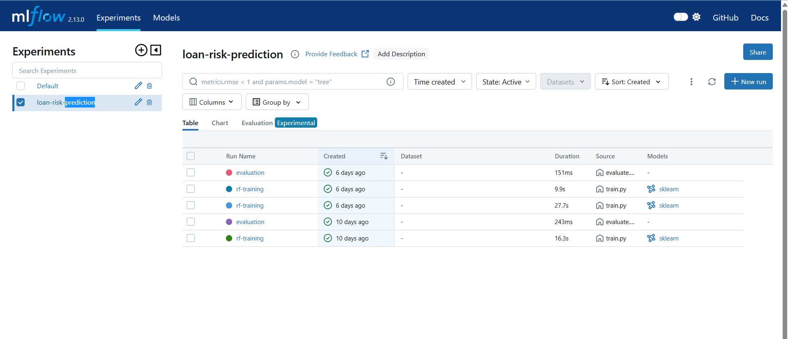

### 2. MLflow Metrics
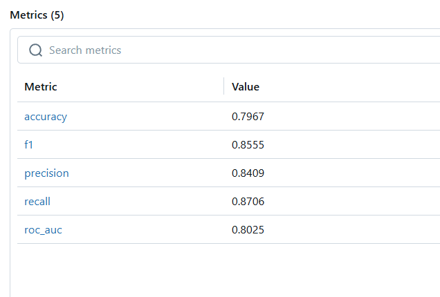

### 3. MLflow Parameters
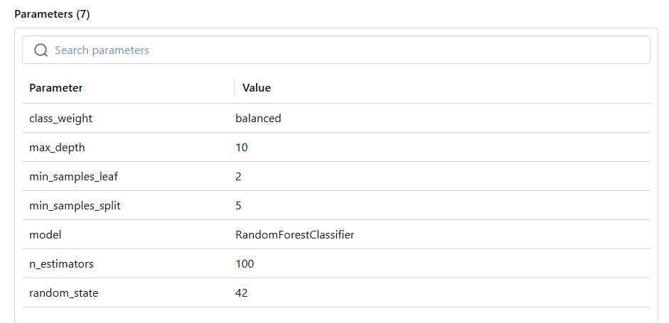

### 4. DVC Pipeline DAG
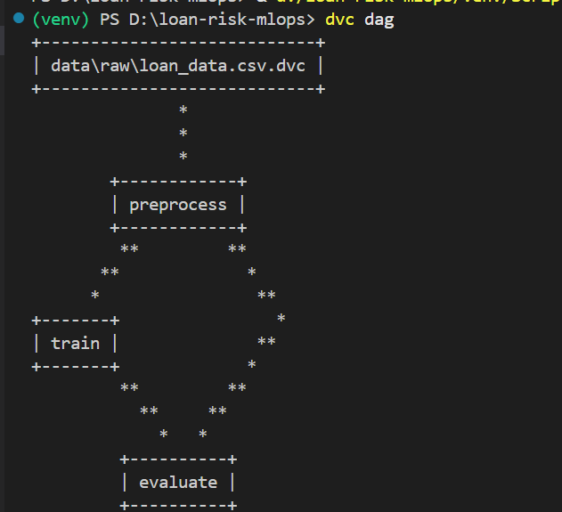

### 5. DVC Metrics
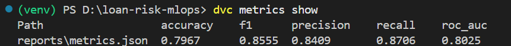

### 6. API Documentation (Swagger UI)
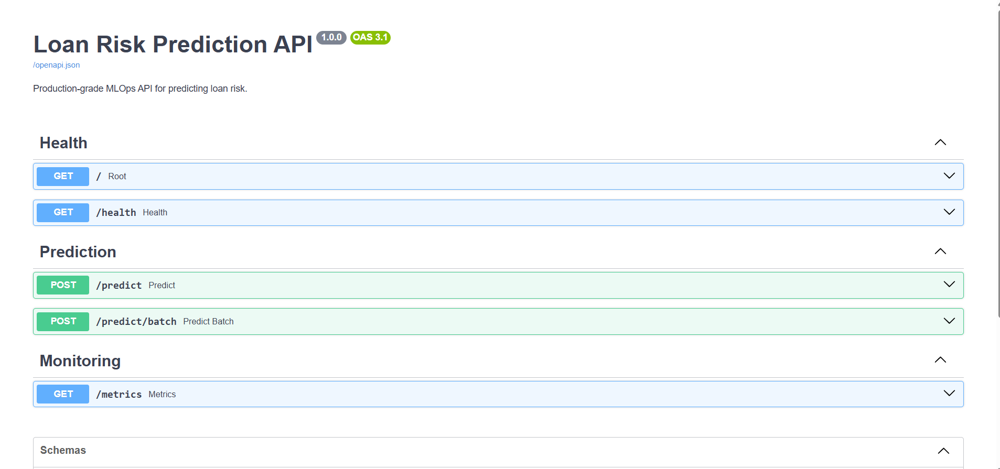

### 7. API Prediction Response
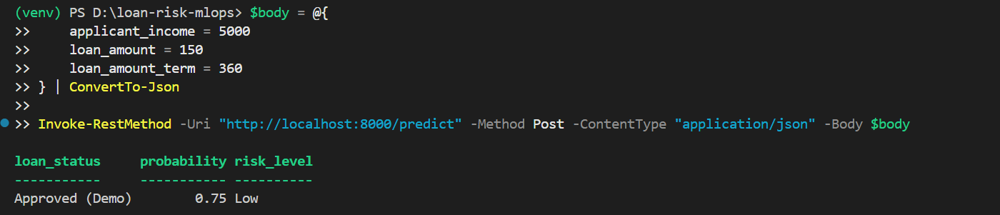

### 8. Docker Container Running
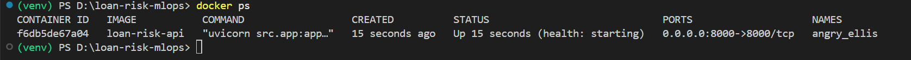

### 9. GitHub Actions — All Jobs Passing
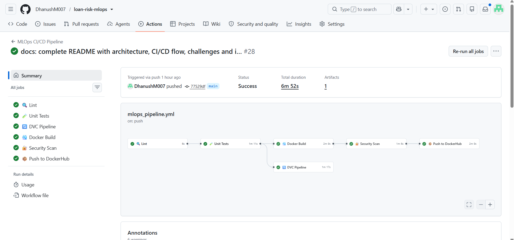

### 10. DockerHub — Image with Latest Tag
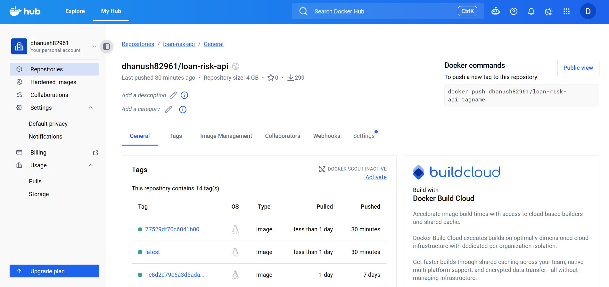

### 11. Data Drift Report (Evidently AI)
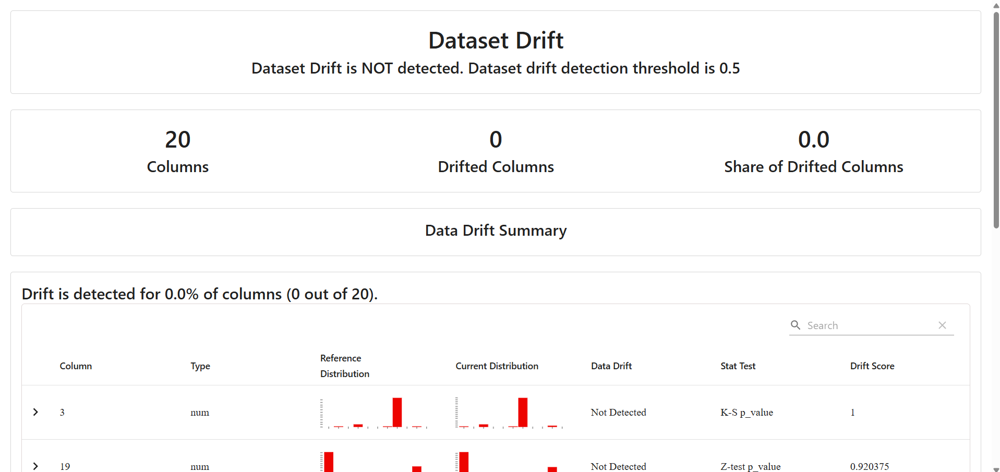

### 12. GitHub Secrets Configuration
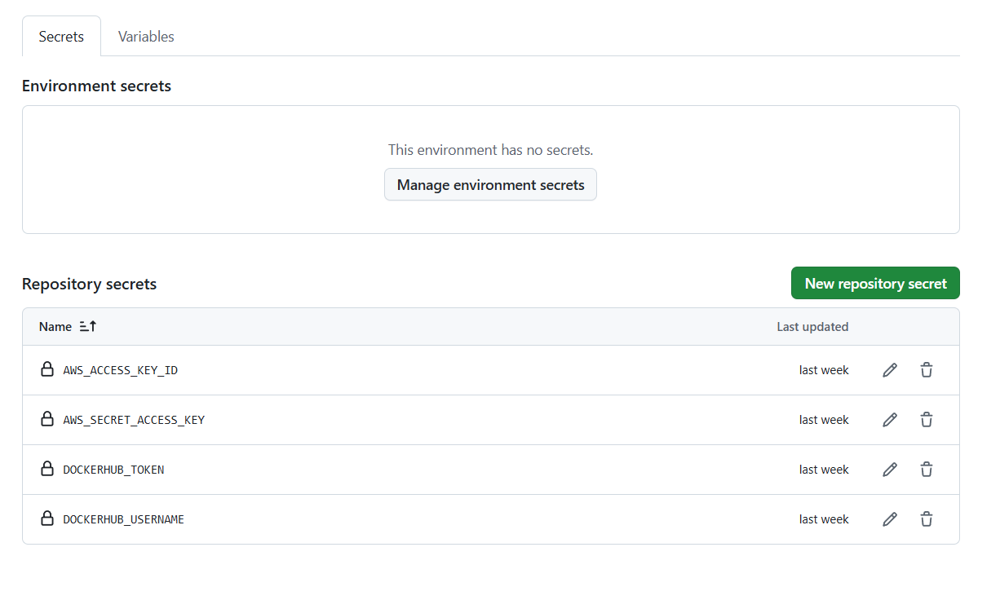

---

## ⚠️ Challenges & Limitations

1. **DVC + Git conflict** — processed files must be managed exclusively by DVC, not committed to Git
2. **MLflow in CI** — MLflow tracking runs locally; no remote tracking server in GitHub Actions
3. **Demo mode** — API runs without model in Docker build; model mounted at runtime via volume
4. **Free tier S3** — Limited to 5GB storage for DVC remote

## 🚀 Future Improvements

1. Kubernetes deployment for auto-scaling
2. Automated retraining triggered by drift detection alerts
3. MLflow Model Registry with staging/production promotion
4. Real-time Grafana dashboards connected to live API
5. Explainable AI (SHAP values) for loan decision transparency
6. Cloud deployment on AWS ECS or GCP Cloud Run

---

## 📚 References

- [DVC Documentation](https://dvc.org/doc)
- [MLflow Documentation](https://mlflow.org)
- [FastAPI Documentation](https://fastapi.tiangolo.com)
- [Evidently AI](https://docs.evidentlyai.com)
- [Prometheus](https://prometheus.io/docs)
- [Trivy](https://aquasecurity.github.io/trivy)